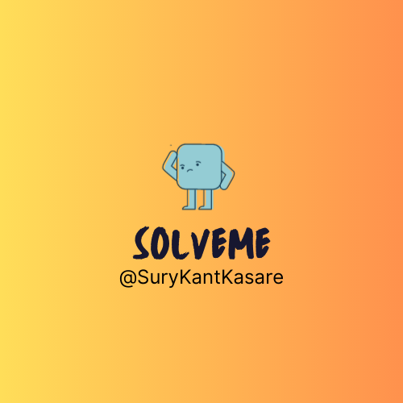

#  SolveMe - The Ultimate Quiz App

Hey, everyone! I wanted to share a sneak peek of my latest project, SolveMe - a quiz app that's sure to challenge and entertain you!


## Features

- Diverse Categories: Choose from a wide range of categories including Films, Music, Computers, Anime, History, and Mathematics.

- Fresh and Up-to-Date Questions: Questions are sourced from an [ open API ](https://opentdb.com/) to ensure that they are always fresh and up-to-date.

- Fun and Engaging Gameplay: Enjoy answering questions within a time limit and earn points for correct answers. Compete with friends and see who can achieve the highest score.

- Built with React Native: SolveMe is developed using React Native, allowing for cross-platform compatibility.

## Getting Started

To get started with SolveMe, follow these steps:

1. Clone the repository:
   ```shell
   git clone https://github.com/surykantkasare/SolveMe
   ```
2. Install the dependencies:
   ```shell
    npm install
   ```
3. Launch the app on your device or emulator using Expo:
   ```shell
    expo start
   ```
  _Please note that Expo is required to run the app on your device. You can install Expo from the App Store or Play Store, depending on your device's operating system._
## Get in Touch

If you have any questions, feedback, or suggestions regarding SolveMe, feel free to reach out to me on [LinkedIn](https://www.linkedin.com/in/surykant-kasare/).

Check out SolveMe now available on the app store!

- **Expo Link:** [SolveMe Expo](https://expo.dev/@surykant_k/SolveMe)

Feel free to share your achievements and experiences with SolveMe using the following hashtags:

- #SolveMeQuiz
- #QuizEnthusiast
- #QuizTime
- #PlaySolveMe
